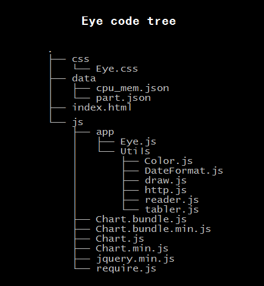

# 关于这个project的结构



- css: css style
- data: local test json data
- js: contrl code
- js/app: self-code
- js/app/Utils: utils self-code
- [Chart*](http://www.chartjs.org/)
- [require.js](http://requirejs.org/)
- [jquery.min.js](http://jquery.com/)

## Function

- reader.js
	- readJson

- draw.js [oop][1]
	- render.prototype.`drawLine`
	- render.prototype.`drawCircle`
	- render.prototype.`lineUpdate`
	- render.prototype.`draw`
	- render.prototype.`update`
	- example
	```js
	//a canvas draw a line
	var ctx1 = document.getElementById("cpu").getContext("2d");
	var data = []
	var Render = new drawer.render(ctx1,"line",data,"cpu","red");
	Render.draw();
	setInterval(
		function(){
			Render.update(reader.random(100));
		},
	1000);

	//a canvas draw multi-line
	var ctx1 = document.getElementById("cpu").getContext("2d");
	var data1 = []
	var data2 = []
	var data3 = []
	var Render = new drawer.render(ctx1,"line",[data1,data2,data3],["cpu","mem","bindwith"]);
	Render.draw();
	setInterval(
		function(){
			Render.update([reader.random(100),reader.random(100),reader.random(100)]);
		},
	1000);

	//a canvas draw a circle
	var data2 = [
		["Sentry",45],
		["EventChannl",20],
		["EventGateWay",22],
		["RtspProxy",13],
		["EdgeFE",30],
		["MQTT",13]
	]
	var ctx2 = document.getElementById("part").getContext("2d");
	var Render2 = new drawer.render(ctx2,"circle",data2,"server List");
	Render2.draw();
	Render2.update(["xxxx",35]);
	Render2.update(["yyyy",37]);
	Render2.update(["zzzz",37]);
	```

- tabler.js [oop][1]
	- table.prototype.`updateBody`
	- table.prototype.`sortBody`
	- table.prototype.`click`
	- table.prototype.`dbclick`
	- table.prototype.`search`
	- table.prototype.`sort`
	- table.prototype.`create`
	- example

	```js
	//table
	var tab = '{"icTable": {"icIndex": [6,2,3],"icIndex2": [2,1,5],"icChannelName": ["SEACnnnnnNx_PG","SEACnnnnnNy_PG","haha"],"icUsedBandwidth": [0,9,3],"icTotalBandwidth": [0,7,4],"icRunningSessCount": [6,0,4],"icStatus": ["n/a","n/a","hehe"]}}';

	var Table = new tabler.table("tableId",tab);
	Table.create();
	Table.search("SEACnnnnnNy_PG");
	```


 [1]:http://eloquentjavascript.net/1st_edition/chapter8.html "oop"